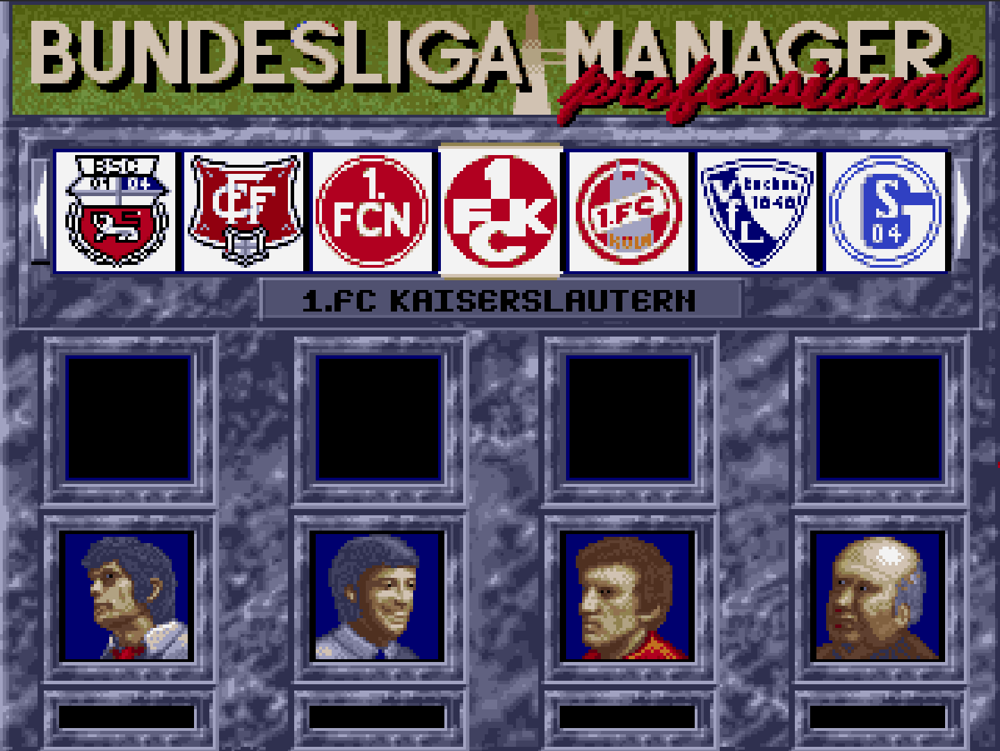

# Bundesliga Manager Professional

[](https://github.com/schowave/bmp/actions/workflows/release.yml)
[](https://hub.docker.com/r/schowave/bmp)

The classic 90s DOS football management game — containerized and playable in the browser via [noVNC](https://novnc.com).

<p align="center">
  
</p>

## Features

- **Browser-based** — play directly in any browser, no client installation needed
- **Persistent savegames** — game saves are stored on the host via Docker volume (`D:` drive in-game)
- **Auto-updates** — [Watchtower](https://containrrr.dev/watchtower/)-compatible via container labels
- **Optimized for streaming** — tuned DOSBox config for low-latency VNC (640x480, 16-bit, frameskip)

## Quick Start

### Docker

```bash
docker run -d \
  -v ./savegame:/savegame \
  -p 8080:80 \
  schowave/bmp:latest
```

Open [http://localhost:8080](http://localhost:8080)

### From Source

```bash
git clone https://github.com/schowave/bmp.git
cd bmp
make run
```

## Architecture

```
Browser (noVNC) ──WebSocket──▸ websockify :80 ──▸ TigerVNC :5901
                                                       │
                                                  Ratpoison WM
                                                       │
                                                  DOSBox 0.74-3
                                                   ├── C: /dos/bmp     (game files)
                                                   └── D: /savegame    (persistent saves)
```

## Deployment

### Synology NAS

1. Create a project folder on your NAS (e.g. `/volume1/docker/bmp/`)
2. Add the `docker-compose.yml` from this repository
3. In **Container Manager** → **Project** → **Create**, point to the folder and start
4. If using a reverse proxy, add WebSocket headers under **Custom Header**:

   | Header | Value |
   |---|---|
   | `Upgrade` | `$http_upgrade` |
   | `Connection` | `$connection_upgrade` |

The container is labeled for [Watchtower](https://containrrr.dev/watchtower/) — if a Watchtower instance is running on the NAS, it will automatically pull new images on release.

### Other Platforms

The Docker image `schowave/bmp` is built for `linux/amd64`.

```yaml
services:
  bmp:
    image: schowave/bmp:latest
    ports:
      - "8080:80"
    volumes:
      - ./savegame:/savegame
    restart: unless-stopped
```

## Releases

Releases are managed via GitHub Actions:

1. Go to **Actions** → **Release** → **Run workflow**
2. Either enter a version number or leave empty to auto-increment the patch version (e.g. `0.1.0` → `0.1.1`)
3. The workflow updates `VERSION`, creates a git tag, builds a multi-arch Docker image, and pushes to Docker Hub
4. Watchtower picks up the new image automatically on connected hosts

> Requires GitHub Secrets: `DOCKERHUB_USERNAME` and `DOCKERHUB_TOKEN`

## Development

| Command | Description |
|---|---|
| `make build` | Build the container image |
| `make run` | Stop, build, and start in detached mode |
| `make stop` | Stop and remove the container |
| `make push` | Build and push multi-arch image to Docker Hub |

## Savegames

The game mounts two DOS drives:

| Drive | Mount | Purpose |
|---|---|---|
| `C:` | `/dos/bmp` | Game files (inside container) |
| `D:` | `/savegame` | Persistent saves (Docker volume on host) |

Save your games to `D:` in-game to persist them across container restarts and updates.
